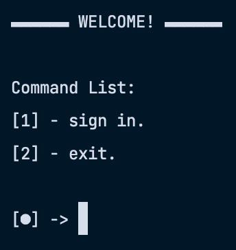

<!-- header -->
<div align="center">
  
  <h1>Budny</h1>
  </br>
  
  </br>
</div>

## About

The prototype of the console bot for the game "Heroes of War and Money". At the moment, the bot can only get a job.

## Technology stack

- **Building the application in Maven 3.9**
- **Java 17**
- **Selenium 4**

## Environment requirements

- **Maven 3.9**
- **Java 17**

## How to use

``` shell
git clone https://github.com/quesoon/budny
```
``` shell
mvn compile && mvn exec:java -Dexec.mainClass="org.semul.budny.Budny"
```

## Contributors ✨

<!-- ALL-CONTRIBUTORS-LIST:START -->
<!-- markdownlint-disable -->
<table>
  <tbody>
    <tr>
      <td align="center" valign="top" width="14.28%"><a href="https://github.com/algorov"><br /><sub><b>SEMUL</b></sub></a><br /><a href="https://github.com/algorov/emb/commits?author=algorov" title="Code">💻</a></td>
    </tr>
  </tbody>
</table>

<!-- markdownlint-restore -->
<!-- ALL-CONTRIBUTORS-LIST:END -->
